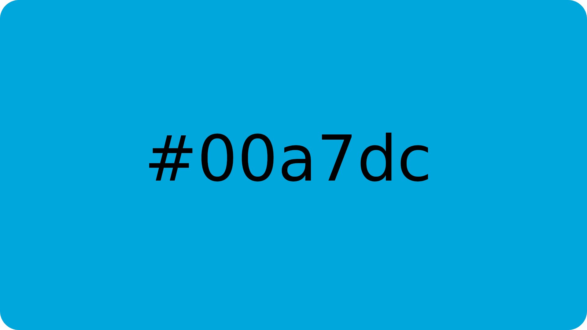
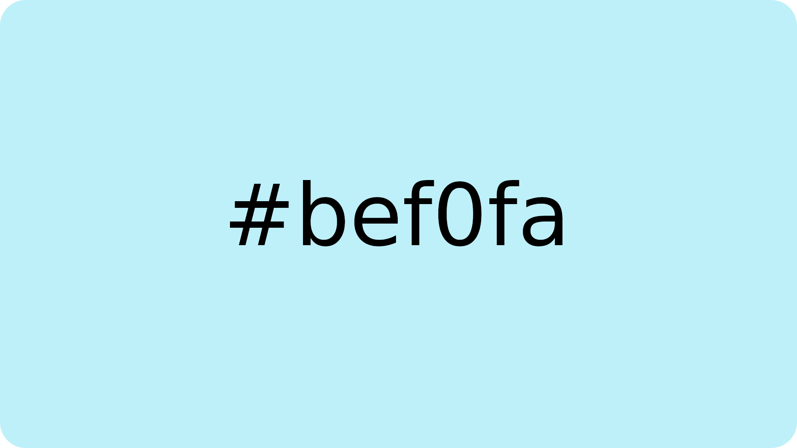
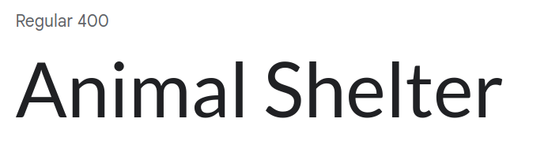
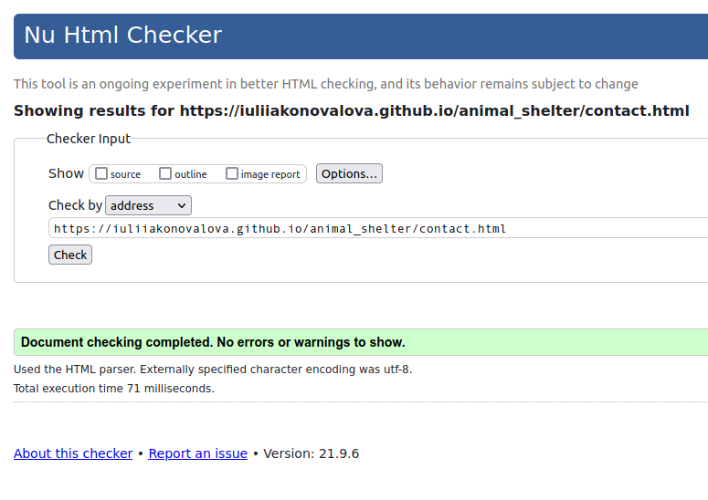
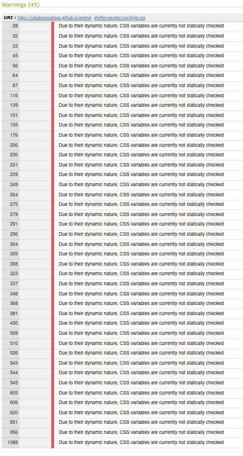
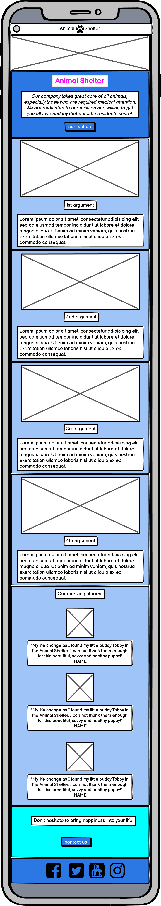
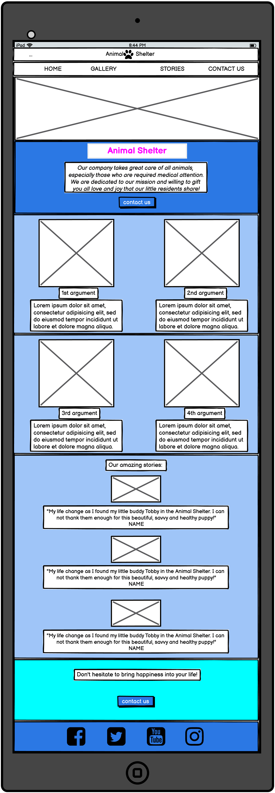

---

# *Animal Shelter*

The Animal Shelter website allows people to learn about the company "Animal Shelter" and find information about animals living in this shelter. The visitors of the website could quickly contact the company about adopting animals as well as making a donation.

The site can be accessed by this [link](https://iuliiakonovalova.github.io/animal_shelter/)

---
## User Stories

### First Time Visitor Goals:

* As a First Time Visitor, I want to easily understand the main purpose of the site, so I can learn more about the organization.
* As a First Time Visitor, I want to be able to easily navigate through the website, so I can find the content.
* As a First Time Visitor, I want to see the testimonials, so I can see whether the organization is trustworthy.

### Returning VisitorGoals:

* As a Returning Visitor, I want to see various pets, so that I can pick from.
* As a Returning Visitor, I want to see information about animals, so that I can learn about each animal and make a prudent decision.
* As a Returning Visitor, I want to find a way to get in contact with the organization, so that I can ask additional questions or send a request about a particular animal.
* As a Returning Visitor, I want to find community links, so that I can learn more about the organization.

### Frequent Visitor Goals:
* As a Frequent User, I want to check whether there are any changes with available animals, so I can make a choice which animal to adopt.
* As a Frequent User, I want to have options for the reason to contact the company, so I can get an explicit answer to my email. 

## Features

+ ### Navbar

+ ##### Navigation
    - Positioned at the top of the page.
    - Contains logo of the company on the left side.
    - Contains navigation links on the right side:
        * HOME - leads to the home page where users can learn about the company Animal Shelter.
        * GALLERY - leads to the gallery page where users can see available animals in the Animal Shelter.
        * CONTACT - leads to the contact form page where users can fill out the form in order to get in touch with the company.
    - The links have animated hover effect.
    - The navigation is clear and easy to understand for the user.
    

    - The navigation bar is responsive:
        * On tablets: navigation bar is split into to lines: the first line filled with the logo and the second line filled with links. All elements are centered.
        

        * On mobile devices: 
            - navigation bar filled with the logo in the center and a hamburger menu implemented on the left side of the navigation bar.      
            
        
            - When the hamburger menu is clicked, there is dropdown menu with the links in the same order.
            

---

+ ### Home Page

    - Represent: 

        * the main idea of the company.
        * Emphasize the strong points of the company.
        * Shows feedback from satisfied clients.
        * Invites to fill out the contact form.

    

---

+ ##### Hero Section

    - Hero section have a fixed background image.

    - Hero section have the block section below the image that consist:

        * The name of the company.
        * Short description of the company's philosophy.
        * Contact button that leads directly to the contact page.

    
    

--- 

---    
+ ##### Highlights Section

    - Hightlight Section has 4 cards with strong descriptive characteristics of the company.

    - Tells website visitors how well animals are in the Animal Shelter.

    - Attracts viewers to use this company for animal adoption.

    
    

    ---
+ ##### Testimonials Section

    - Testimonials Section has three feedbacks from people who were satisfied with the company's service.

    - Each card has a picture of an animal with its owner.

    - Each card has a story from the people who had an experience of using the Animal Shelter.

    - Each card has a name of the pet's owner.

​
    

---
+ ##### Call to Action Section

    - Call to Action Section has an explicit message for the visitors of the website to contact the company.

    - Is also has a button that directs to the contact page.
​
    

---
+ ##### Footer

    - Footer contains social media links that open in a new tab.
​
    
​
---
+ ### Gallery Page

    - Gallery page has a hero image and an introduction message for the visitors that contains an incentive to contact the company.

    - It has a button right after the introduction message that leads to the contact form page.

    - It has photos of the animals that a present in the Animal Shelter in real-time.

        - The gallery is responsive: the size of the photo depends on the user's screen.
        - Each image has a description of the animal that appears on hover.
        - description information contains the name of the animal and its characteristics.

    - It has a call to action section below the gallery with the incentivizing message and the button that leads to the contact form.

    - It has a footer identical to the home page's footer.
    
​
    

---
+ ### Contact page

    - Contact page has a contact form:

        - All text input fields are customized.
        - Labels are animated when the input field is in focus and are not empty.
        - All inputs are set to be required to fill out.
        - It has to checkboxes for the visitors to fill voluntary:

            - The 1st is - ADAPT, which helps the company to understand the motive of the visitor.
            - The 2nd is - DONATE, which motivates users to consider financial support for the company. 

        - The submit button is animated on hover.

    - The page is responsive on all common screen sizes.

    - The submit button leads to the response page.
​
    

---
+ ### Response page

    - Response page appears after submitting the contact form.
    - It contains the thank you message and the promise to get in touch with the applicant within 24 hours.

    

---
## Technologies Used

- [HTML](https://developer.mozilla.org/en-US/docs/Web/HTML) was used as the foundation of the site.
- [CSS](https://developer.mozilla.org/en-US/docs/Web/css) - was used to add the styles and layout of the site.
- [CSS Flexbox](https://developer.mozilla.org/en-US/docs/Learn/CSS/CSS_layout/Flexbox) - was used to arrange items simmetrically on the pages.
- [CSS Grid](https://developer.mozilla.org/en-US/docs/Web/CSS/grid) - was used to make "gallery" and "contact" pages responsive.
- [CSS roots](https://developer.mozilla.org/en-US/docs/Web/CSS/:root) was used to declaring global CSS variables and apply them throughout the project. 
- [Balsamiq](https://balsamiq.com/) was used to make wireframes for the website.
- [VSCode](https://code.visualstudio.com/) was used as the main tool to write and edit code.
- [Git](https://git-scm.com/) was used for the version control of the website.
- [GitHub](https://github.com/) was used to host the code of the website.
- [GIMP](https://www.gimp.org/) was used to make and resize images for the README file.

---
## Design

- Soft blue color was used as the main color of the website due to its phycological effect on people's minds. As this color is associated with trustworthiness and reliability, website visitors could build a firm believe in the organization "Animal Shelter".

- Light Blue Color was used as a background color since this color creates a sense of tranquility and makes a connection between animal's ownership and peacefulness.
 

- Purple color was used to make an emphasis on the logo and leave a memorable effect on the website visitors.

- Lato Google Font was used as the main font of the website in order to increase readability of the content on the pages.

- Lobster Google Font was used to attract viewers' attention to the company's logo, to make an accent on the strong points of the company, and to incentivize visitors to contact "Animal Shelter".

---

## Testing

In order to confirm the correct functionality, responsiveness, and appearance:

+ The website was tested on the following browsers: Chrome, Firefox, Brave.

    - Chrome:

<figure class="video_container">
  <video controls="true" allowfullscreen="true" poster="">
    <source src="documentation/browsers_google.mp4" type="video/mp4">
  </video>
</figure>

    - FireFox:

    - Brave:

    ;

+ The website was checked by devtools implemented in Firefox and Chrome browsers.
+ The website was checked with [Responsive Website Design Tester](https://responsivedesignchecker.com/).
+ The functionality of the links in the website was checked as well by different users.

---
​
### Bugs
+ ##### Solved bugs
    1. The testimonials pictures had a square shape in Brave browser on a mobile phone when the border radius had been set to 50%. It was due to the outline properties settings instead of the border
    
        *Solutions:* Outline was replaced with border properties.
    
    1. The gallery image descriptions were not appearing on the picture when hovering it as the position of the .image_content was set to fixed.
        
        *Solution:* The .image_content position was set to absolute, with the top: 0, left: 0, and added padding on the .image_content. 

    1. Footer on the contact page was reducing the size of the screen and shrank the contact form as the height of the background image was set to calc(100vh-the size of the footer)
        
        *Solution:* The height of the image was set to 100hv, and the display of the footer was set to fixed.
    ---
+ ##### Unsolved bugs
    - None.
+ ##### Mistakes
    - Mistakes were made while committing changes. I used past simple tense in commits due to the habit when I just started working on this project.
    - While progressing in my code I learned to use present simple tense in commits.

---
## Validator testing
+ ##### HTML
    ###### Home Page
    - No errors or warnings were found when passing through the official W3C validator.

    ###### Gallery Page
    - No errors or warnings were found when passing through the official W3C validator.

    ###### Contact Page
    - No errors or warnings were found when passing through the official W3C validator.

    ###### Response Page
    - No errors or warnings were found when passing through the official W3C validator.

    
+ ##### CSS
    No errors or warnings were found when passing through the official W3C (Jigsaw) validator except:
    
    - 3 errors regarding *all: unset*: "Property all doesn't exist. The closest matching property name is fill : unset".

    - 43 warning regarding the use of *:root variables*: "Due to their dynamic nature, CSS variables are currently not statically checked".

+ ##### Accessibility and performance 
    - Using lighthouse in devtools I confirmed that the website is performing well, accessible and colors and fonts chosen are readable.
    

---
## Deployment

- The site was deployed to GitHub pages. The steps to deploy are as follows: 
  - In the [GitHub repository](https://github.com/IuliiaKonovalova/animal_shelter), navigate to the Settings tab 
  - From the source section drop-down menu, select the **Main** Branch, then click "Save".
  - The page will be automatically refreshed with a detailed ribbon display to indicate the successful deployment.

The live link can be found [here](https://iuliiakonovalova.github.io/animal_shelter)

## Local Deployment

In order to make a local copy of this project, you can clone it.
In your IDE Terminal, type the following command to clone my repository:

- `git clone https://github.com/IuliiaKonovalova/animal_shelter.git`

- Alternatively, if you use Gitpod, you can [click here](https://gitpod.io/#https://github.com/IuliiaKonovalova/animal_shelter), which will start the Gitpod workspace for you.

---
## Credits

+ #### Content

    - Inspiration for the gallery hover effect came from the article "How to add a gradient to overlay to a background image using just CSS and HTML" published the website [Web Dev etc](https://webdevetc.com).
    - Inspiration for the responsive hamburger navbar came from [Kevin Powell](https://www.youtube.com/user/KepowOb) on his YouTube channel.
    - The content was checked by my dear friend Zulya.

+ #### Media

    - All the images for the website were taken from [Unsplash](https://unsplash.com/).
    + [Hero image](https://unsplash.com/photos/9gz3wfHr65U);
    + Main cons images:
        - [1st image](https://unsplash.com/photos/_STvosrG-pw)
        - [2nd image](https://unsplash.com/photos/v3-zcCWMjgM);
        - [3rd image](https://unsplash.com/photos/W4EUiwceZjs);
        - [4th image](https://unsplash.com/photos/sXU6BeWoZqI).
    + Testimonial Section: 
        - [1st image](https://unsplash.com/photos/UCFgM_AojFg);
        - [2nd image](https://unsplash.com/photos/ISg37AI2A-s);
        - [3rd image](https://unsplash.com/photos/2WeHZHIW6v0).
    + Gallery:
         - [1st image](https://unsplash.com/photos/gKXKBY-C-Dk);
         - [2nd image](https://unsplash.com/photos/FdR_CoENqp8);
         - [3rd image](https://unsplash.com/photos/C0zDWAPFT9A);
         - [4th image](https://unsplash.com/photos/WrG-lFojjW4);
         - [5th image](https://unsplash.com/photos/IbPxGLgJiMI);
         - [6th image](https://unsplash.com/photos/tf2BKM9iy9o);
         - [7th image](https://unsplash.com/photos/iYQC9xWMvw4);
         - [8th image](https://unsplash.com/photos/o_QTeyGVWjQ);
         - [9th image](https://unsplash.com/photos/AH7JYgyAlqA);
         - [10th image](https://unsplash.com/photos/sssxyuZape8);
         - [11th image](https://unsplash.com/photos/4tc7_jEgGzg);
         - [12th image](https://unsplash.com/photos/GewH2PtoR1s);
         - [13th image](https://unsplash.com/photos/7GX5aICb5i4);
         - [14th image](https://unsplash.com/photos/VvO8e8n0Ffg);
         - [15th image](https://unsplash.com/photos/1Y4LupdrDZk);
         - [16th image](https://unsplash.com/photos/uumnRC_kVks);
         - [17th image](https://unsplash.com/photos/h7VBJRBcieM);
         - [18th image](https://unsplash.com/photos/Ud4k7O6CJPM);
         - [19th image](https://unsplash.com/photos/ngqyo2AYYnE);
         - [20th image](https://unsplash.com/photos/g3B53PbBfwU);
         - [21st image](https://unsplash.com/photos/JSfsK9VH4q8);
         - [22nd image](https://unsplash.com/photos/FilM6ng7VGQ);
         - [23rd image](https://unsplash.com/photos/UtrE5DcgEyg);
         - [24th image](https://unsplash.com/photos/IuJc2qh2TcA);
         - [25th image](https://unsplash.com/photos/1-sM8xqPFTM);
         - [26th image](https://unsplash.com/photos/zBvVuRJ71vU);
         - [27th image](https://unsplash.com/photos/dEtvMzcbYiA);
         - [28th image](https://unsplash.com/photos/J7rRzjba-kY);
         - [29th image](https://unsplash.com/photos/mx0DEnfYxic);
         - [30th image](https://unsplash.com/photos/VwqecUsYKvs);

    - All images were compressed by using the website [Compress JPEG](https://compressjpeg.com/).
    - All images for the gallery were resized by using the website [IMGonline.com.ua](https://www.imgonline.com.ua/eng/resize-image.php).
    - Images for the README file were made or edited with [GIMP](https://www.gimp.org/).

---
## Wireframes

### Mobile devices

### Tablets

### Desktop

