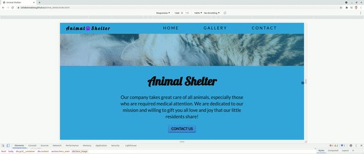
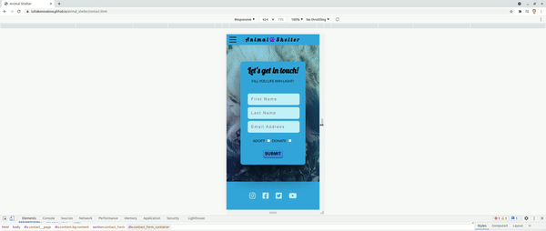

# TESTING

## Compatibility

In order to confirm the correct functionality, responsiveness, and appearance:

+ The website was tested on the following browsers: Chrome, Firefox, Brave.

    - Chrome:

    

    - FireFox:

    

    - Brave:

    

## Responsiveness

+ The website was checked by devtools implemented in Firefox and Chrome browsers.

    - Main Page:

    

    - Gallery Page:

    

    - Contact Page:

    

    - Response Page:

    

+ The website was checked with [Responsive Website Design Tester](https://responsivedesignchecker.com/).

    - Desktop Screens:

    
    
    
    
    
    
    
    

    - Tablet Screens:

    
    
    
    
    
    

    - Mobile Screens:

    
    
    
    
    
    
    

+ The functionality of the links in the website was checked as well by different users.

## Manual testing

| feature | action | expected result | tested | passed | comments |
| --- | --- | --- | --- | --- | --- |
| Navbar | | | | | |
| Home | Click on the "Home" link | The user is redirected to the main page | Yes | Yes | - |
| Gallery | Click on the "Gallery" link | The user is redirected to the gallery page | Yes | Yes | - |
| Contact | Click on the "Contact" link | The user is redirected to the contact page | Yes | Yes | - |
| Footer | | | | | |
| Instagram icon in the footer | Click on the Instagram icon | The user is redirected to the Instagram page | Yes | Yes | - |
| Facebook icon in the footer | Click on the Facebook icon | The user is redirected to the Facebook page | Yes | Yes | - |
| Twitter icon in the footer | Click on the Twitter icon | The user is redirected to the Twitter page | Yes | Yes | - |
| YouTube icon in the footer | Click on the YouTube icon | The user is redirected to the YouTube page | Yes | Yes | - |
| Home page | | | | | |
| "Contact Us" button in Hero section | Click on the "Contact Us" button | The user is redirected to the contact page | Yes | Yes | - |
| "Contact Us" button in Call to action section | Click on the "Contact Us" button | The user is redirected to the contact page | Yes | Yes | - |
| Gallery page | | | | | |
| "Contact Us" button in Hero section | Click on the "Contact Us" button | The user is redirected to the contact page | Yes | Yes | - |
| Image in the gallery | User hover the image | Pet's name and description appear on the image | Yes | Yes | - |
| "Contact Us" button in Call to action section | Click on the "Contact Us" button | The user is redirected to the contact page | Yes | Yes | - |
| Contact page | | | | | |
| First name input | Enter the first name | The first name is entered | Yes | Yes | If user doesn't enter the first name, the error message appears |
| Last name input | Enter the last name | The last name is entered | Yes | Yes | If user doesn't enter the last name, the error message appears |
| Email input | Enter the email | The email is entered | Yes | Yes | If user doesn't enter the email, the error message appears. If user enters not valid email, the error message appears |
| Adopt and donate checkbox | Click on the checkbox | The checkbox is checked | Yes | Yes | These checkboxes are not required as the user can choose not to adopt or donate and other reasons for contacting |
| "Submit" button | Click on the "Submit" button | The user is redirected to the response page | Yes | Yes | - |
| Response page | | | | | |
| Response message | The user will be automatically redirected to the home page after 10 seconds | The user is redirected to the home page | Yes | Yes | - |

---
## Validator testing
+ ### HTML
  #### Home Page
    - No errors or warnings were found when passing through the official W3C validator.

    
    
  #### Gallery Page
    - No errors or warnings were found when passing through the official W3C validator.

    

  #### Contact Page
    - No errors or warnings were found when passing through the official W3C validator.

    

  #### Response Page
    - No errors or warnings were found when passing through the official W3C validator.

    
    
+ ### CSS
  No errors or warnings were found when passing through the official W3C (Jigsaw) validator except:
    
    - 3 errors regarding *all: unset*: "Property all doesn't exist. The closest matching property name is fill : unset".

    - Even though this error is present, I don't believe it is 100% accurate, and more information can be found [here](https://developer.mozilla.org/en-US/docs/Web/CSS/all)

  
  
    - 43 warning regarding the use of *:root variables*: "Due to their dynamic nature, CSS variables are currently not statically checked".
    
  

+ ## LightHouse report

    - Using lighthouse in devtools I confirmed that the website is performing well, accessible and colors and fonts chosen are readable.
    
  ### Home page

  

  ### Gallery page

  

  ### Contact page

  

  ### Response page

  

---
​
## Bugs
+ ### Solved bugs
    1. The testimonials pictures had a square shape in Brave browser on a mobile phone when the border radius had been set to 50%. It was due to the outline properties settings instead of the border
    
        *Solutions:* Outline was replaced with border properties.
    
    1. The gallery image descriptions were not appearing on the picture when hovering it as the position of the .image_content was set to fixed.
        
        *Solution:* The .image_content position was set to absolute, with the top: 0, left: 0, and added padding on the .image_content. 

    1. Footer on the contact page was reducing the size of the screen and shrank the contact form as the height of the background image was set to calc(100vh-the size of the footer)
        
        *Solution:* The height of the image was set to 100hv, and the display of the footer was set to fixed.
    ---
+ ### Unsolved bugs
    - None.
+ ### Mistakes
    - Mistakes were made while committing changes. I used past simple tense in commits due to the habit when I just started working on this project.
    - While progressing in my code I learned to use present simple tense in commits.

---